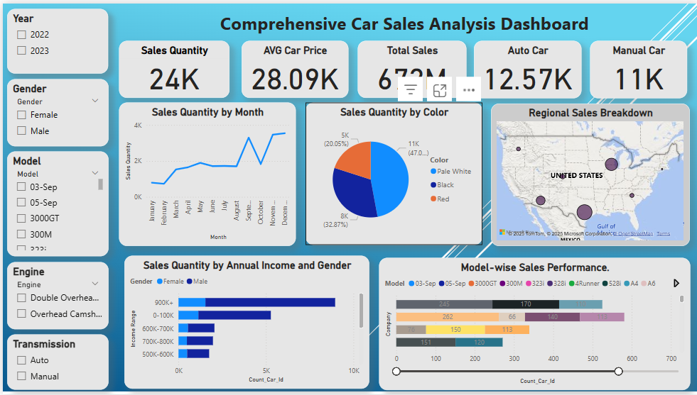

# CAR BRAND SALES ANALYSIS

## Overview
This project showcases a comprehensive analysis of car sales data for the years 2022 and 2023, presented through an interactive Power BI dashboard. The dashboard provides insights into sales trends, regional performance, customer demographics by income and gender, and model popularity, making it a valuable tool for automotive industry analysts and business decision-makers.

As part of my data analysis portfolio, this project demonstrates my skills in **data cleaning** (Excel), **data visualization** (Power BI), and **DAX** for creating calculated columns and measures. The final dashboard enables stakeholders to explore key metrics and trends with ease.

**[View the Dashboard](#)|[Download car_sales_dashboard.pbix](Car_sales_dashboard.pbix)**  

  

## Project Type
- **Data Analysis**

## Tools Used
- **Excel**: For data cleaning and preparation.
- **Power BI**: For creating an interactive dashboard with visualizations.

## Project Details

### 1. Data Cleaning (Using Excel)
The dataset was cleaned to ensure accuracy and consistency before visualization. Key steps included:

- **Find and Replace**:
  - Corrected encoding issues by replacing "Double Overhead Camshaft" with "Double Overhead Camshaft" in the `Engine` column.
  
- **Convert Date Format**:
  - Transformed the `Date` column from text to date format (MM/DD/YY) using Excel's text-to-columns and formatting tools.

- **Convert Numeric Columns**:
  - Converted `Annual Income` and `Price ($)` to number format to enable calculations.

- **Remove Duplicates**:
  - Identified and removed duplicate entries using the `Car_id` column, ensuring each row is unique.

### 2. Power BI Analysis
Power BI was used to create an interactive dashboard with the following visualizations and measures:

- **i. Sales Quantity**:
  - **Measure**: `Sales Quantity = COUNT('car sales'[Car_id])`
  - Displays the total number of car sales.

- **ii. Average Car Price**:
  - **Measure**: `Avg Car Price = AVERAGE('car sales'[Price ($)])`
  - Shows the average price of cars sold.

- **iii. Monthly Sales Quantity Trend**:
  - **Visual**: Line Chart
  - **X-Axis**: Created a new column for "Month Name" using `Month Name = FORMAT('car_sales'[Date], "mmmm")`.
  - **Y-Axis**: Count of `Car_id` (aggregated as Sum).
  - **Legend**: Optional "Year" for multi-year trends.

- **iv. Sales Distribution by Car Color**:
  - **Visual**: Pie Chart
  - **Legend**: "Color"
  - **Values**: Count of `Car_id`

- **v. Regional Sales Breakdown**:
  - **Visual**: Filled Map
  - **Location**: "Dealer_Region"
  - **Values**: Sum of `Price ($)`
  - **Note**: Geocoding was applied to map regions accurately.

- **vi. Sales Quantity by Annual Income and Gender**:
  - **Visual**: Stacked Bar Chart
  - **X-Axis**: Created bins for "Annual Income" using a calculated column:
    - `Income Bin = SWITCH(TRUE(), 'car_sales'[Annual Income] <= 100000, "0-100K", 'car_sales'[Annual Income] <= 200000, "100K-200K", 'car_sales'[Annual Income] <= 300000, "200K-300K", 'car_sales'[Annual Income] <= 400000, "300K-400K", 'car_sales'[Annual Income] <= 500000, "400K-500K", 'car_sales'[Annual Income] <= 600000, "500K-600K", 'car_sales'[Annual Income] <= 700000, "600K-700K", 'car_sales'[Annual Income] <= 800000, "700K-800K", 'car_sales'[Annual Income] <= 900000, "800K-900K", 'car_sales'[Annual Income] > 900000, "900K+", "Unknown")`
  - **Y-Axis**: Count of `Car_id`

- **vii. Model-wise Sales Performance**:
  - **Visual**: Bar Chart
  - **X-Axis**: "Model"
  - **Y-Axis**: Count of `Car_id`
  - **Legend**: "Company"
  - **Filters**: Sorted descending and limited to the top 10-15 models.
  - **Formatting**: Used pink bars to match the dashboard design.

## Key Skills Demonstrated
- **Data Cleaning**: Proficient in preparing raw datasets using Excel (e.g., handling encoding errors, formatting dates, and removing duplicates).
- **Power BI Visualization**: Skilled in creating interactive dashboards with various visuals (Line Charts, Pie Charts, Filled Maps, Stacked Bar Charts).
- **DAX**: Experienced in writing DAX formulas for calculated columns (e.g., `Income Bin`) and measures (e.g., `Sales Quantity`, `Avg Car Price`).
- **Data Analysis**: Able to derive actionable insights from sales data, including trends, demographic analysis, and regional performance.

## Usage
- **Explore the Dashboard**: Open `car_sales_dashboard.pbix` in Power BI Desktop to interact with the dashboard. Use slicers to filter by year, gender, and other dimensions to analyze sales trends, regional performance, and model popularity.
- **View the Dataset**: Open `car_sales.csv` to review the raw data and `car_sales_cleaned.csv` to see the cleaned dataset used in the dashboard.

## Repository Contents
- `car sales.csv`: The raw dataset used for analysis.
- `car_sales_cleaned.csv`: The cleaned dataset after Excel processing.
- `car_sales_dasboard.pbix`: The Power BI file containing the final dashboard.

## Optional Setup (For Replication)
If you'd like to replicate or extend this analysis:
- **Install Power BI Desktop** to open and explore the `car_sales_dashboard.pbix` file.
- **Recreate the Cleaning Process**: Use `car_sales_cleaned.csv`, apply the data cleaning steps in Excel, and import the cleaned data into Power BI to rebuild the dashboard.

## About This Project
This project was developed as part of my data analysis portfolio to demonstrate my ability to transform raw data into meaningful insights using industry-standard tools. It highlights my expertise in data cleaning, visualization, and dashboard creation, making it a strong example of my capabilities for roles in data analysis, business intelligence, and automotive industry analytics.

## Contributors
- Emmanuel Kipkurui Bett- Data Analyst and Project Lead.
